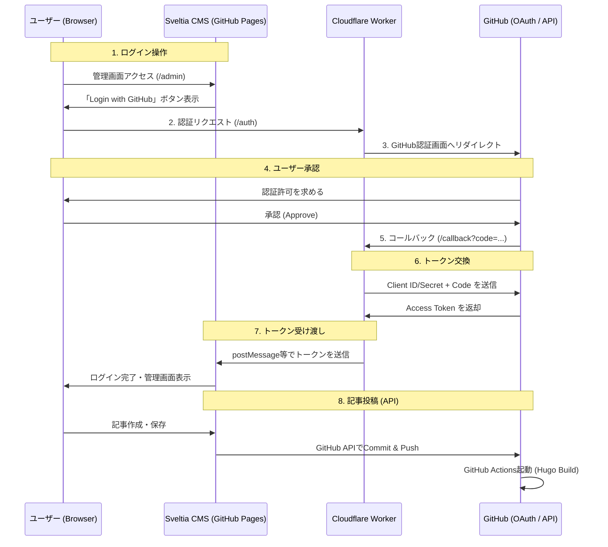

#### 選定基準
無料で使えることを優先してgithub pagesを選択
毎回git pushするのがだるい&出先やスマホから編集できるようCMSを導入 (OAuthで認証する)
当初Decap CMSを導入しようとしていたが、CMS側のバグ？かメッセージの期待値が不透明で10時間近く溶けたのでsveltia CMSを導入

#### OAuthの認証処理の流れ

#### 導入方法
##### GitHub側設定
Settings > Developer settings > OAuth AppsからNew OAuth Appsを作成する。(Authorization callback URLにCloudflare Workersのcallbackを指定する)
Client IDとClient Secretをここで生成して控えておく

##### Cloudflare側設定
OAuth仲介用のWorker用コードを配置して環境変数として上記Cilent IDとSecretを指定する。現在は自作コードになっているがsveltia-cms-authというCloudflareデプロイ用のコードを公式が用意しているのでそれを使った方が楽
