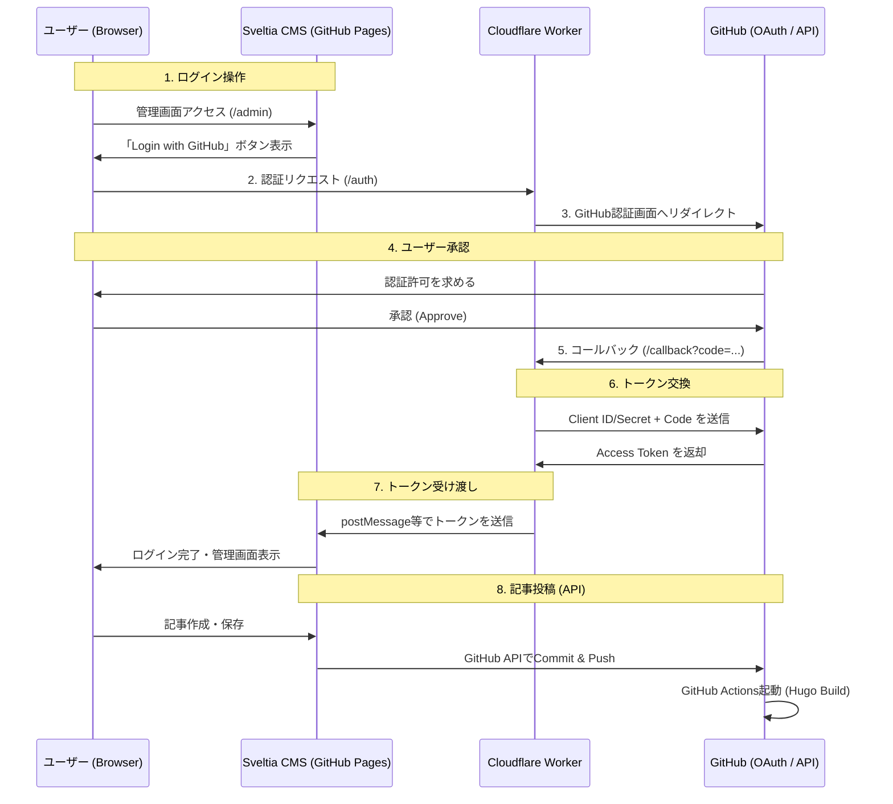

```mermaid
sequenceDiagram
    participant User as ユーザー (Browser)
    participant CMS as Sveltia CMS (GitHub Pages)
    participant CF as Cloudflare Worker
    participant GH as GitHub (OAuth / API)

    Note over User, CMS: 1. ログイン操作
    User->>CMS: 管理画面アクセス (/admin)
    CMS->>User: 「Login with GitHub」ボタン表示
    User->>CF: 2. 認証リクエスト (/auth)
    CF->>GH: 3. GitHub認証画面へリダイレクト
    
    Note over User, GH: 4. ユーザー承認
    GH->>User: 認証許可を求める
    User->>GH: 承認 (Approve)
    GH->>CF: 5. コールバック (/callback?code=...)
    
    Note over CF, GH: 6. トークン交換
    CF->>GH: Client ID/Secret + Code を送信
    GH->>CF: Access Token を返却
    
    Note over CF, CMS: 7. トークン受け渡し
    CF->>CMS: postMessage等でトークンを送信
    CMS->>User: ログイン完了・管理画面表示
    
    Note over CMS, GH: 8. 記事投稿 (API)
    User->>CMS: 記事作成・保存
    CMS->>GH: GitHub APIでCommit & Push
    GH->>GH: GitHub Actions起動 (Hugo Build)
```
